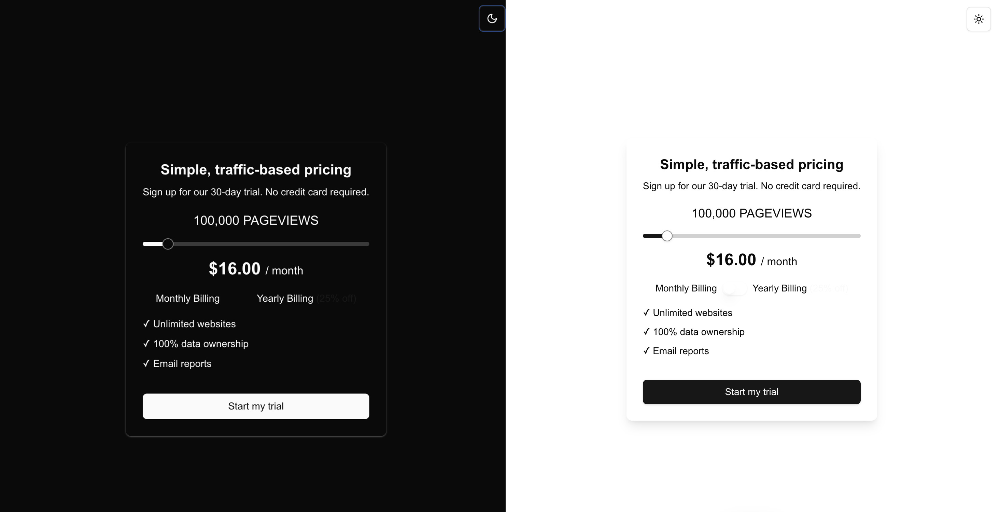

# Frontend Mentor - Interactive Pricing Component Solution

This is a solution to the [Interactive Pricing Component challenge on Frontend Mentor](https://www.frontendmentor.io/challenges/interactive-pricing-component-t0m8PIyY8). Frontend Mentor challenges help you improve your coding skills by building realistic projects. 

## Table of contents

- [Overview](#overview)
  - [The challenge](#the-challenge)
  - [Screenshot](#screenshot)
  - [Links](#links)
- [My process](#my-process)
  - [Built with](#built-with)
  - [What I learned](#what-i-learned)
  - [Continued development](#continued-development)
  - [Useful resources](#useful-resources)
- [Author](#author)
- [Acknowledgments](#acknowledgments)

## Overview

### The challenge

Users should be able to:

- View the optimal layout for the app depending on their device's screen size
- See hover states for all interactive elements on the page
- Use the slider and toggle to see prices for different page view numbers

### Screenshot

### Links

- Solution URL: [My Frontend Mentor Solution](https://www.frontendmentor.io/solutions/interactive-pricing-component-using-nextjs-and-shadcn-bRzTyLw8tK)
- Live Site URL: [Live Site on Vercel](https://investo-full-stack-dev-assignment.vercel.app/)

## My process

### Built with

- Semantic HTML5 markup
- CSS custom properties
- Flexbox
- CSS Grid
- Mobile-first workflow
- [React](https://reactjs.org/) - JS library
- [Next.js](https://nextjs.org/) - React framework
- [ShadCN UI](https://shadcn.dev) - For consistent UI components
- [Tailwind CSS](https://tailwindcss.com/) - For utility-first styling
- [next-themes](https://github.com/pacocoursey/next-themes) - For dark mode support

### What I learned

This project helped me solidify my understanding of:
- **Responsive Design with Tailwind CSS**: I learned how to use responsive utilities to make the component adapt to both mobile and desktop screens.
- **Dark Mode with `next-themes`**: I learned how to handle dark mode in Next.js with `next-themes` and how to avoid hydration issues by delaying rendering until the theme is set.
- **Using ShadCN Components**: Integrating ShadCN components was a great way to maintain a consistent UI style across all elements, and customizing them for specific needs taught me valuable styling techniques.

### Continued development

In future projects, I’d like to focus on:
- **Accessibility**: Making interactive elements like sliders and toggles fully accessible.
- **Optimizing Theme Performance**: Ensuring smooth theme switching and minimizing flickering on page load.

### Useful resources

- [next-themes documentation](https://github.com/pacocoursey/next-themes) - Helped me understand theme switching and avoid common hydration errors.
- [ShadCN UI](https://shadcn.dev) - This library made it easy to add consistent, customizable UI components.
- [The Markdown Guide](https://www.markdownguide.org/) - Great reference for creating markdown files like this README.

## Author

- Website - [Parv Gugnani](https://parv-gugnani.vercel.app/)
- Frontend Mentor - [@Parv-gugnani](https://www.frontendmentor.io/profile/Parv-gugnani)
- Twitter - [@Parv_developer](https://x.com/parv_developere)

## Acknowledgments

Thanks to the Frontend Mentor community for providing feedback and inspiration. Special thanks to the developers behind `next-themes` and ShadCN for making dark mode and UI consistency easier to implement.

---
